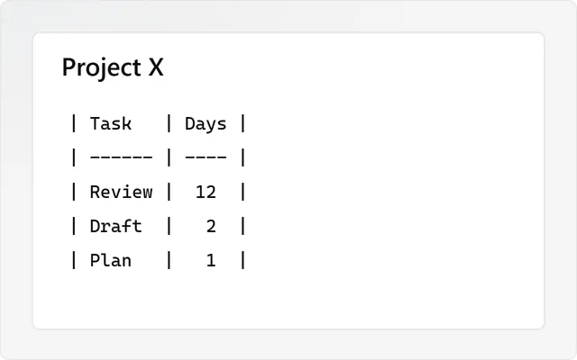
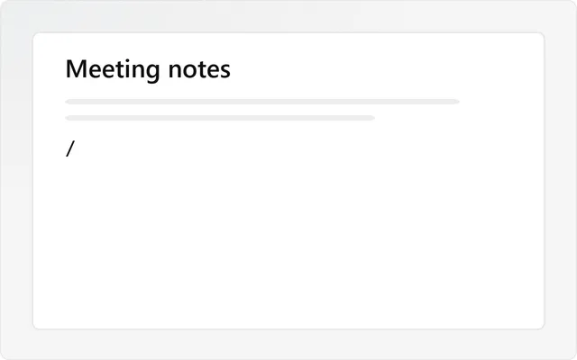
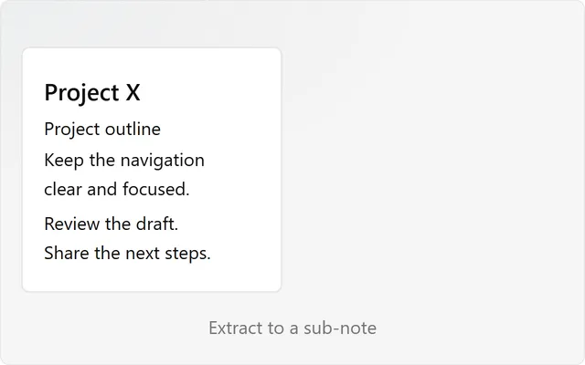
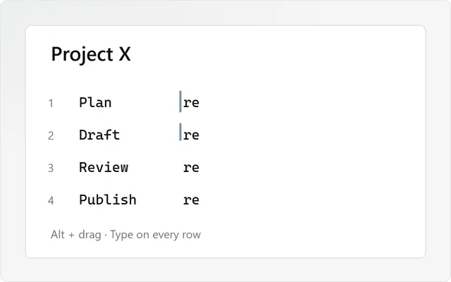
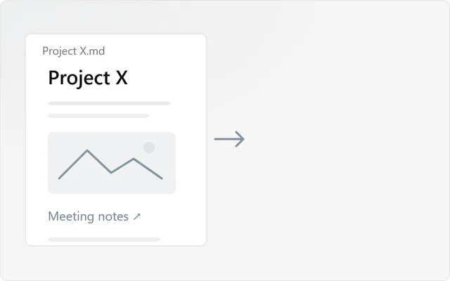
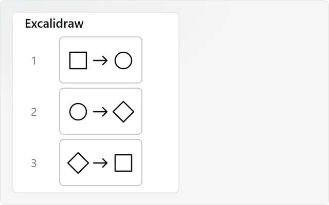

<h1 align="center">Snailkit</h1>

<b>Everything your notes need, in one shell.</b> 
A free suite for Obsidian, built around one way of working: 
catch your ideas, write tasks anywhere, find everything in one place.

---

## 1. Catch your ideas, then sort them

Ideas come in bursts. Open a **brainstorm** and pour everything out, in plain sentences, without
choosing a place or a format. Then go through it once:

**Write** freely · **Sort** each line: a task, a question, or just an idea · **Finish** with a one-line summary · **Archive** when it is done.

Nothing gets lost, and nothing is left floating. [How brainstorms work →](docs/sessions.md)

## 2. Write tasks anywhere, find them in one list

A task belongs where it was born: in a meeting note, a project, today's daily note. Write
`- [ ] Call Paul #client` and move on.

**Tasks** gathers every tagged task of your vault into one calm list, grouped by tag. Check,
schedule or move them from there: the note follows. **Tags** suggests the right tag as you type
and gives each family its color. [More on tasks →](docs/tasks.md)

## 3. One home for your notes

**Home** is the front page of your vault, filled in from your notes: today, your pins, your
domains on a map, what you opened lately. **Search** finds a note, a task or a tag in a few
letters. Home, Tasks and Brainstorm live side by side in the **Workbench**. [Tour of Home →](docs/home.md)

On every note, the **Note menu** keeps the contents, the open tasks and the calendar one click
away. [Note menu →](docs/note-rail.md)

## And a few handy tools

<table>
<tr>
<td width="50%"> <b><a href="docs/tag-colors.md">Tags</a></b> Tags in steady colors, grouped by family.</td>
<td width="50%"> <b><a href="docs/search.md">Search</a></b> Notes, tasks and tags, found in a few letters.</td>
</tr>
<tr>
<td> <b><a href="docs/tables.md">Tables</a></b> Shape and sort tables without wrestling with Markdown.</td>
<td> <b><a href="docs/slash-menu.md">Slash menu</a></b> Type <code>/</code> and insert the right block.</td>
</tr>
<tr>
<td> <b><a href="docs/move-text.md">Move text</a></b> Give a passage its own note. Keep the link.</td>
<td> <b><a href="docs/column-select.md">Column select</a></b> One edit, several lines at once.</td>
</tr>
<tr>
<td> <b><a href="docs/pdf-export.md">PDF export</a></b> Your note, its look, its links. All in a PDF.</td>
<td> <b><a href="docs/slides-export.md">Slides to PowerPoint</a></b> Your Excalidraw frames, ready for PowerPoint.</td>
</tr>
</table>

## Get started

1. In Obsidian: **Settings → Community plugins → Browse**, search **Snailkit**, install and enable it.
2. Open **Settings → Snailkit** and pick your tools, or **Get them all**. Each one starts off and leaves nothing behind when you turn it off.
3. Write a task with a `#tag` in any note. It is already waiting in your Workbench.

English, French, Dutch and Spanish. Desktop and mobile. Snailkit sends nothing about you or your
notes anywhere. The only network access is PDF export loading the web images your note already
shows. Two tools write outside your vault, only where you ask: PDF export (the PDF you save, and a
temporary page in your system's temp folder while it prints) and Slides to PowerPoint (the .pptx you save).
Tasks, Home and Search read the list of your notes to gather tasks and find notes, inside Obsidian
only. The clipboard is used only when you ask: Column select copies and pastes columns, Move text
can copy the link to the moved text, Search copies a link to a note.

---

Made slowly by Arnaud Gastelblum · <a href="https://lazysnail.net">lazysnail.net</a> 
<a href="https://github.com/arnaudgastelblum/snailkit/issues">Report a problem</a> · <a href="LICENSE">MIT license</a> · <a href="docs/developers.md">For developers</a>

