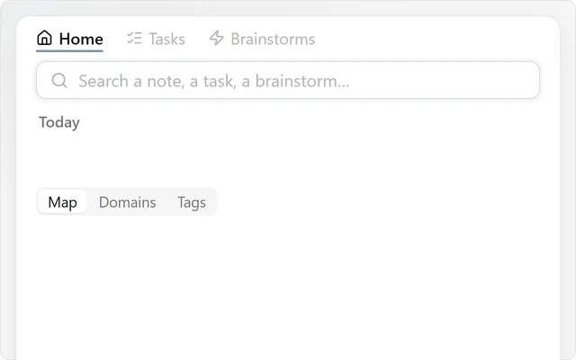

[Snailkit](../README.md) · **Home**

# Home

The front page of your vault. It fills itself in from your notes: nothing to set up, nothing to
maintain.

## What you find there

- **Search**, the cursor already in it.
- **Today**: today's note, the tasks due, the brainstorms waiting, and **New brainstorm**.
- **Your pins**, the notes you come back to.
- **A map of your notes**, drawn from the links between them. Drag a note onto another to place
  it under it.
- **Recent**: what you opened lately.

## The idea

Give each note a parent, with an `up: "[[Projects]]"` property or a link on its first line. Home
draws your vault from there: your main notes become **domains**, each with its notes and its open
tasks. No folders to maintain.

## Good to know

- Home is the first tab of the [Workbench](workbench.md). It can open by itself when Obsidian starts and in every new tab.
- The **Map**, **Domains** and **Tags** views show the same vault three ways.
